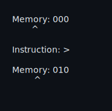
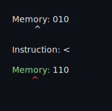

# Bitter Interpreter in C

A C implementation of the Bitter esoteric programming language - a minimalist
`Brainf*ck` variant that operates on single-bit memory cells.

["Like Brainfuck - only much, much worse." - User:DMC, creator of Bitter](https://esolangs.org/wiki/Bitter)

## Hello, World

The following Bitter source code outputs "Hello, World!\n" to `stdout`:


## About Bitter

Bitter is a Turing-complete esoteric programming language created by [User:DMC](https://esolangs.org/wiki/User:DMC)
that operates on single-bit memory cells.

Key features:

- 1-bit memory cells
- Only 4 core commands: `<`, `>`, `(`, `)`
- 2 interpreter commands: `!`, `#`
- Infinite, unbounded memory tape (positive direction only)
- Memory initialized to 0

## Language Commands

| Command | Description                                                |
| ------- | ---------------------------------------------------------- |
| `>`     | Move pointer right by 1 and invert the bit                 |
| `<`     | Move pointer left by 1 and invert the bit                  |
| `(`     | If current bit is 1, continue; else jump past matching `)` |
| `)`     | Jump back to matching `(`                                  |
| `!`     | (Debug) Dump memory from 0 to highest data pointer reached |
| `#`     | (Debug) Pause execution and dump memory                    |




## Installation

1. Clone this repository:

   ```shell
   git clone https://github.com/ragibasif/bitter.git
   cd bitter
   ```

2. Run `make`

   ```shell
   make all
   ```

## Usage

### REPL

Run the following in the command line to start the `REPL`:

```shell
./bitter
```

To exit out of the `REPL`, enter the following:

```shell
:quit
```

### Source File

Run the `./bitter` command with the `<filename>.bitr` as the argument:

```shell
./bitter <filename>.bitr
```

## Examples

```shell
examples/
├── 00_hello_world.bitr -> Load memory 0 through 111 with 'Hello, World!\n'
├── 01_truth_machine_0.bitr -> initialize data[0] = 0 and end on data[1] = 0
└── 02_truth_machine_1.bitr -> infinite loop: fill memory with 1 and dump memory
```

Example of evaluating the truth machine from the `REPL`:


Example of evaluating the truth machine from a source file:


Example of evaluating the infinite loop truth machine from a source file:


## Acknowledgements

- [Bitter on Esolang Wiki](https://esolangs.org/wiki/Bitter)
- [User:DMC - Creator of Bitter](https://esolangs.org/wiki/User:DMC)
